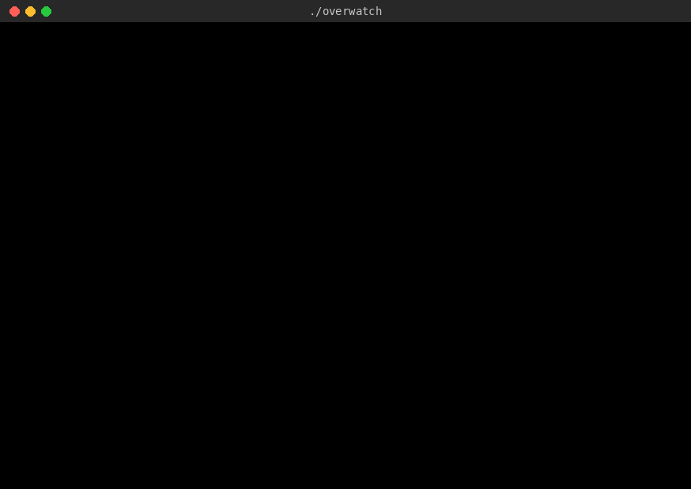

# Claude Overwatch

I wanted to actually see what Claude was doing on my Mac while it worked in Cowork. The summary
at the end is nice, but I wanted to watch it happen. So I built `./overwatch`.

It's a VS Code window that types out everything Claude does as it happens: every command it runs,
everything those commands print, and every line of code it writes. Green on black, like an old
terminal. Nothing gets summarized or skipped, and there are no fake hacker effects. If Claude
ran it or wrote it, you see it.



That's a real session (Claude writes a small script, runs it, hits an error, fixes it), recorded
from the window and played back at its actual speed.

> This is a personal side project. It's not made by or affiliated with Anthropic ("Claude" is
> their trademark), and it has nothing to do with Blizzard's Overwatch.

## How it works day to day

Every time you start a Cowork task, Claude asks one question: **"Run ./overwatch for this task?"**

- **Yes** and the feed picks up right away in the VS Code window.
- **No** and Claude works like it normally does.

If you open the window late (or close VS Code halfway through), it replays the task from the
beginning and then keeps going live.

## What you'll see in the window

| Line | What it means |
|---|---|
| `▸ Step 2 - try it on a sample [15:20:57]` | Claude started a new step |
| `$ python3 wordcount.py sample.txt` | a command, typed out as it runs (`>` for extra lines) |
| indented lines | everything the command printed, all of it |
| `↳ ✓ 0.4s` or `↳ ✗ exit 1 · 0.4s` | it worked, or it failed (in red), plus how long it took |
| `✎ writing wordcount.py (18 lines · changed: lines 3, 15-16)` | a file being written. Every line shows with line numbers, then `✓ saved` |
| `web> open https://…` and `--- page text: …` | Claude opened a web page, and the full text it read |
| `↳ ✓ 1.2s · cloud` | something Claude ran outside your Mac (downloads, installs) |
| `▸ Summary: …` | at the end: time per step, how many passed/failed |

## What you need

- A Mac with [VS Code](https://code.visualstudio.com)
- The Claude desktop app with Cowork, working in a folder on your Mac
- Custom skills turned on in Claude (they need "Code execution and file creation")

## Setup

1. **Add the skill to Claude.** Download [`dist/overwatch-skill.zip`](dist/overwatch-skill.zip).
   In Claude go to **Customize › Skills**, hit **+**, then **Create skill › Upload a skill**, and
   pick the zip.
2. **Start a Cowork task** in the folder you work in (mine is `~/Claude-Workspace`). When Claude
   asks "Run ./overwatch for this task?", say **Yes**. The first time, it sets the folder up for you.
3. **Open the window.** Double-click **Open Overwatch.command** in that folder. VS Code opens with
   just the feed running, nothing else. (The first time, macOS might complain since it came from the
   internet: right-click it and choose Open. And if VS Code asks whether you trust the folder, say
   yes, or the feed can't start.) I keep the window tiled on the left half of my screen.

That's it. You don't have to edit anything.

If you'd rather set the folder up yourself, download this repo and run:

```bash
bash install.sh ~/Claude-Workspace
```

You still need the skill from step 1 so Claude knows to use the feed.

## Stuff worth knowing

- **It won't mess with your other settings.** It adds its settings to that one folder's
  `.vscode/settings.json`, keeps whatever you already had, and saves a backup
  (`settings.json.before-overwatch`). Your other VS Code windows aren't touched.
- **Every terminal in that folder turns into the feed.** If you want a normal shell there, pick
  **Plain shell** from the terminal dropdown.
- **It keeps up.** It types at a readable speed and only speeds up when it falls behind (like
  when a command dumps thousands of lines), then goes back to normal.
- **Just the feed.** The window opens with no file list, tabs, status bar or panels. If you had
  already opened that folder in VS Code before installing, press Cmd+B once to hide the file list;
  it stays hidden after that.
- **Long lines wrap** if the window is narrow. At font size 11, half a laptop screen fits about
  100 characters of code.

## What's inside

```
Claude (in Cowork)                              your Mac (the ./overwatch window)
  source .vscode/live.sh                          .vscode/claude-live.zsh
  live_run / live_write / live_web ...  ──►  .claude-live.log  ──►  types it out
                                        ◄──  .overwatch.alive / .overwatch.pos
                                             (so Claude knows the window is open and caught up)
```

| File (in your folder) | What it does |
|---|---|
| `.vscode/live.sh` | the commands Claude uses to send things to the feed |
| `.vscode/claude-live.zsh` | the viewer that types it all out |
| `.vscode/zdot/.zshrc` | makes terminals in that folder open as the feed (except "Plain shell") |
| `.vscode/overwatch-settings.json` | the VS Code settings it adds |
| `.vscode/overwatch.conf` | your time zone, for the timestamps |
| `Open Overwatch.command` | opens the folder in VS Code |
| `.claude-live.log` | the current task's feed (starts fresh each task) |
| `.overwatch-stats.log` | one line per task: time, passed/failed |

The skill itself is in [`skill/overwatch/SKILL.md`](skill/overwatch/SKILL.md) if you want to see
exactly what Claude is told to do.

## Tests

```bash
bash tests/run-tests.sh
```

It installs into a temp folder and runs 28 checks: exit codes, every output line and every line of
code showing up exactly, the change summaries, the summary at the end, and the viewer replaying a
full task (that part needs zsh). The other checks need GNU tools, so run it in Claude's Cowork
shell or on Linux.

## Removing it

```bash
bash uninstall.sh ~/Claude-Workspace
```

That removes its files and settings and leaves the rest of your folder alone. Then delete the
skill under **Customize › Skills**.

## Limits

- Mac + VS Code only for now.
- One feed per folder, so run one task at a time in it.
- It only shows what Claude actually runs through it. If Claude does something completely inside
  its own tools, it shows up when Claude logs it with `live_remote`.

## Why "./overwatch"

It's written like a script you'd run in a terminal. Green text on black, typing itself out while
something else does the work... honestly I'm just trying to channel Neo with this.

## Feedback

I built this with Claude in Cowork and use it for my own tasks. If something breaks or you have an idea,
open an issue. I'm curious how it works for other people.

## License

MIT. See [LICENSE](LICENSE).
